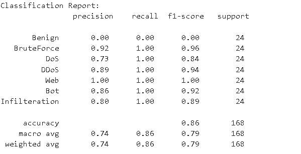

# TinyLLaMA for Cyber GNN dataset
## Baseline

## Results
+ **TinaLLaMA** is trained by incorporating both _1) edge features_ and _2) textual information_ to enhance its predictive capabilities.
+ Due to *memory constraints*, I employed _continuous learning_, incrementally increasing the dataset size during training to optimize resource utilization.

### Darknet Dataset Results
| Model Name                                   | Phase   | Training/Val/Test Set Size | Epochs | Number of Batch | Batch Size | Learning Rate | Test Loss                                | Test F1 Score                            | Model Path                                     |
|----------------------------------------------|---------|----------------------------|--------|-----------------|------------|---------------|------------------------------------------|-------------------------------------------|------------------------------------------------|
| TinaLLaMA (w/ edgefeatures) | Phase 1 | 874 / 98 / 108            | 10     | 87              | 10         | 1.00E-05      | 0.5793                                   | 0.9191                                    |     |
| TinaLLaMA (w/ edgefeatures) | Phase 2 | 864 / 108 / 108            | 10     | 87              | 10         | 1.00E-05      | **0.1116** | **0.9907** | `model/20241109-164753_llm_w_edgefeat.pth`  |

### Darknet Test Sample Results

#### Test Sample 1
- **Test set results:** loss= 0.1116, accuracy= 0.9907, f1_score(weighted)= 0.9907

#### Test Sample 2
- **Test set results:** loss= 0.2312, accuracy= 0.9815, f1_score(weighted)= 0.9814

---

### CSE-CIC Dataset Results

| Model Name                                   | Phase   | Training/Val/Test Set Size | Epochs | Number of Batch | Batch Size | Learning Rate | Test Loss | Test F1 Score | Model Path                                     |
|----------------------------------------------|---------|----------------------------|--------|-----------------|------------|---------------|-----------|---------------|------------------------------------------------|
| TinyLlama (w/ edgefeatures) | Phase 1 | 1360 / 152 / 168          | 10     | 136             | 10         | 1.00E-05      | 0.6059    | 0.7906        | `model/20241113-181010_llm_w_edgefeat.pth`     |
| TinyLlama (w/ edgefeatures) | Phase 2 | 1360 / 152 / 168          | 10     | 136             | 10         | 1.00E-05      | 0.3917    | 0.7936        | `model/20241113-194017_llm_w_edgefeat.pth`     |

### CSE-CIC Test Sample Results

#### Test Sample 1
- **Test set results:**  loss= 0.3917, accuracy= 0.8571, f1_score(weighted)= 0.7936

#### Test Sample 2
- **Test set results:** loss= 0.4598, accuracy= 0.8452, f1_score(weighted)= 0.7868

---
